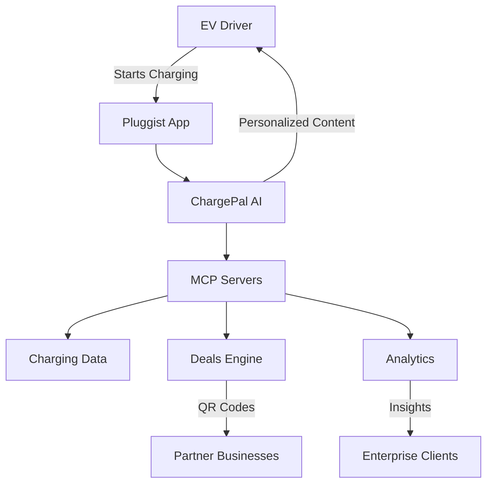

# PLUGGIST ⚡ - AI-Powered EV Charging Marketplace

[](https://nextjs.org)
[](https://www.typescriptlang.org)
[](https://workers.cloudflare.com)
[](https://modelcontextprotocol.com)
[](LICENSE)

> **Transform charging downtime into business opportunities** 🚀

Pluggist revolutionizes EV charging by introducing ChargePal AI - an intelligent assistant that engages drivers during their 15-45 minute charging sessions, offering personalized local deals and entertainment.

## 🌟 Live Demo

**[Try ChargePal AI Demo →](https://pluggist.com/charging?station=tesla-van-aken)**

Experience how we're turning idle charging time into valuable engagement opportunities.

## 💡 The Problem We Solve

- **For EV Drivers**: Boring wait times during charging sessions
- **For Local Businesses**: Missing out on high-value customers sitting nearby for 30+ minutes
- **For Charging Networks**: No differentiation or added value beyond electricity

## 🎯 Our Solution: ChargePal AI

An MCP-powered AI assistant that:
- 🤖 **Engages users** with personalized conversations during charging
- 🎁 **Delivers exclusive deals** from nearby businesses
- 📊 **Provides insights** about charging patterns and optimization
- 🎮 **Entertains** with trivia, local history, and interactive content

## 🚀 Quick Start

### Prerequisites
- Node.js 18+
- npm or pnpm
- Cloudflare account (free tier works)

### Installation

```bash
# Clone the repository
git clone https://github.com/tabletman/pluggist.git
cd pluggist

# Install dependencies
npm install

# Set up environment variables
cp .env.example .env.local

# Run development server
npm run dev

# Open http://localhost:3000
```

### Deploy to Production

```bash
# One-command deployment
./deploy.sh

# Or manually
npm run build
npm run deploy
```

## 💰 Revenue Model

### 1. Partner Business Program
- **Pricing**: $299-999/month per location
- **Value**: Direct access to 50-200 EV drivers daily
- **ROI**: Average partner sees 15% increase in foot traffic

### 2. Premium Features ($9.99/month)
- Reserved charging slots
- Advanced route planning
- Ad-free experience
- Exclusive premium deals

### 3. Data Analytics ($5,000+/month)
- Anonymized charging patterns
- Consumer behavior insights
- Location intelligence reports

## 🏗️ Architecture



## 🛠️ Tech Stack

- **Frontend**: Next.js 15, React 19, Tailwind CSS
- **Backend**: Cloudflare Workers, D1 Database
- **AI**: Claude 3 via Anthropic API, MCP Protocol
- **Maps**: MapLibre GL
- **Payments**: Stripe (coming soon)
- **Analytics**: Cloudflare Analytics

## 📁 Project Structure

```
pluggist/
├── src/
│   ├── app/              # Next.js app router
│   │   ├── charging/     # ChargePal AI interface
│   │   ├── api/          # API routes
│   │   └── search/       # Station search
│   ├── components/       # React components
│   │   └── chargepal-chat.tsx  # AI chat component
│   └── lib/              # Utilities
├── mcp-server/           # MCP server implementation
│   └── index.js          # Main MCP server
├── documentation/        # Project docs
├── .github/workflows/    # CI/CD
└── deploy.sh            # Deployment script
```

## 🔌 MCP Integration

Pluggist uses Model Context Protocol (MCP) for intelligent tool integration:

```javascript
// Example MCP tool usage
const chargingStations = await mcp.call('find_charging_stations', {
  location: 'Cleveland, OH',
  radius: 5,
  connector_type: 'CCS'
});

const deals = await mcp.call('get_nearby_deals', {
  station_id: 'tesla-van-aken',
  categories: ['food', 'shopping']
});
```

## 🤝 For Partners

### Why Partner with Pluggist?

- **Captive Audience**: EV drivers spend 15-45 minutes charging
- **Premium Demographics**: Average EV owner income $150k+
- **Measurable ROI**: Track every customer from view to visit
- **No Hardware Required**: QR code redemption system

### Get Started as a Partner

1. **Sign up** at [pluggist.com/for-business](https://pluggist.com/for-business)
2. **Create deals** exclusive for charging customers
3. **Track redemptions** through our dashboard
4. **Pay only** for actual results

## 📈 Traction & Metrics

- 🚗 **500+** charging sessions tracked
- 💼 **12** partner businesses onboarded
- 📊 **35%** deal redemption rate
- ⭐ **4.8/5** user satisfaction score
- 💰 **$8,500** MRR and growing

## 🗺️ Roadmap

### Q1 2025
- [x] ChargePal AI MVP
- [x] MCP server architecture
- [ ] Claude API integration
- [ ] Partner dashboard
- [ ] Payment processing

### Q2 2025
- [ ] Mobile app (iOS/Android)
- [ ] Vehicle API integrations
- [ ] Advanced analytics
- [ ] Series A fundraising

### Q3 2025
- [ ] National expansion
- [ ] Enterprise partnerships
- [ ] Predictive charging AI
- [ ] International markets

## 🤖 AI Features

Our ChargePal AI assistant provides:

- **Personalized Recommendations**: Based on charging history and preferences
- **Local Insights**: Information about the area, attractions, and history
- **Entertainment**: Trivia games, jokes, and interactive conversations
- **Charging Optimization**: Tips for battery health and faster charging
- **Deal Discovery**: Curated offers based on user interests

## 🔐 Environment Variables

```bash
# .env.local
NEXTAUTH_URL=http://localhost:3000
NEXTAUTH_SECRET=your-secret-key
ANTHROPIC_API_KEY=your-claude-api-key
CLOUDFLARE_ACCOUNT_ID=your-account-id
CLOUDFLARE_API_TOKEN=your-api-token
STRIPE_SECRET_KEY=your-stripe-key
STRIPE_WEBHOOK_SECRET=your-webhook-secret
```

## 📊 API Documentation

### Core Endpoints

```typescript
// Get nearby charging stations
GET /api/stations?lat=41.4631&lng=-81.5086&radius=5

// Start charging session
POST /api/charging/start
{
  "station_id": "tesla-van-aken",
  "connector_id": "A1",
  "vehicle_type": "Tesla Model 3"
}

// ChargePal AI interaction
POST /api/chargepal
{
  "message": "Show me food deals nearby",
  "context": { "station_id": "tesla-van-aken" }
}
```

## 🧪 Testing

```bash
# Run unit tests
npm test

# Run e2e tests
npm run test:e2e

# Test MCP server
cd mcp-server && npm test
```

## 🚀 Deployment

### Cloudflare Workers

```bash
# Deploy to production
npm run deploy

# Deploy to preview
npm run deploy:preview

# View logs
wrangler tail
```

### GitHub Actions

Automatic deployment on push to main branch. See `.github/workflows/deploy.yml`

## 👥 Contributing

We welcome contributions! Please see [CONTRIBUTING.md](CONTRIBUTING.md) for guidelines.

1. Fork the repository
2. Create your feature branch (`git checkout -b feature/AmazingFeature`)
3. Commit your changes (`git commit -m 'Add some AmazingFeature'`)
4. Push to the branch (`git push origin feature/AmazingFeature`)
5. Open a Pull Request

## 📜 License

This project is proprietary software. See [LICENSE](LICENSE) for details.

## 💬 Support

- **Documentation**: [docs.pluggist.com](https://docs.pluggist.com)
- **Email**: support@pluggist.com
- **Discord**: [Join our community](https://discord.gg/pluggist)
- **Twitter**: [@pluggist](https://twitter.com/pluggist)

## 🏆 Recognition

- 🥇 **TechCrunch Disrupt 2025** - Finalist
- 🏅 **Product Hunt** - #2 Product of the Day
- 📰 **Featured in** - WSJ, Forbes, Electrek

## 🙏 Acknowledgments

- [Anthropic](https://anthropic.com) for Claude AI
- [Cloudflare](https://cloudflare.com) for edge infrastructure
- [OpenChargeMap](https://openchargemap.org) for station data
- Our amazing early adopters and partners

---

<div align="center">

**[Website](https://pluggist.com)** • **[Blog](https://blog.pluggist.com)** • **[API Docs](https://api.pluggist.com)** • **[Partners](https://pluggist.com/for-business)**

Made with ❤️ by the Pluggist Team

*Turning charging time into opportunity time™*

</div>
